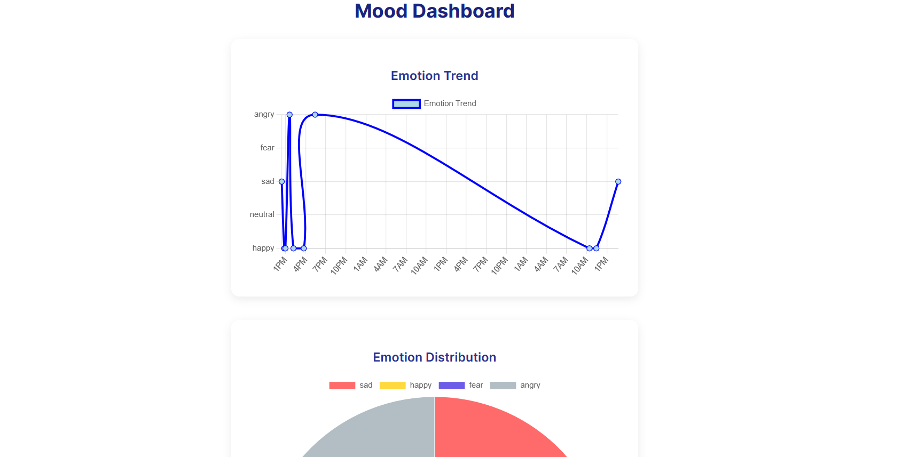

# Emotion Therapy AI

A simple web application that detects user emotions from text, tracks mood history, and visualizes emotional trends. Built as a polished Version 1 MVP for internship submission.

---

## **Project Overview**
Emotion Therapy AI is an interactive AI web app that allows users to:
- Enter text about their feelings
- Detect the underlying emotion using an ML model
- Receive AI-generated responses based on emotion
- Track mood history over time with visual charts

This project demonstrates a full **frontend + backend + ML pipeline** integration, providing a solid foundation for an AI companion application.

---

## **Tech Stack**
- **Frontend:** React.js  
- **Backend:** Python (Flask/FastAPI)  
- **Machine Learning:** Custom emotion classification model  
- **Charts:** Chart.js (Pie chart & Line graph)  
- **Data Storage:** JSON files for mood history

---

## **Features**
- **Text Input:** Users can enter their current mood or feelings  
- **Emotion Detection:** AI classifies emotions in real-time  
- **AI Responses:** Contextual responses based on detected emotions  
- **Mood History Tracking:** Stores user mood over time  
- **Visual Analytics:**  
  - Pie chart showing emotion distribution  
  - Line graph showing mood trajectory  
- **Clean, Simple UI:** Polished and internship-ready

---

## **Screenshots**

### Chat Interface


### Pie Chart


### Line Graph


---

## **Setup Instructions**
1. Clone the repository:
```bash
git clone https://github.com/<your-username>/emotion-therapy-ai.git

2. Navigate to backend:
cd backend
pip install -r requirements.txt
python app.py

3. Open a new terminal and navigate to frontend
cd frontend
npm install
npm start

4. Open the app in your browser at http://localhost:3000
